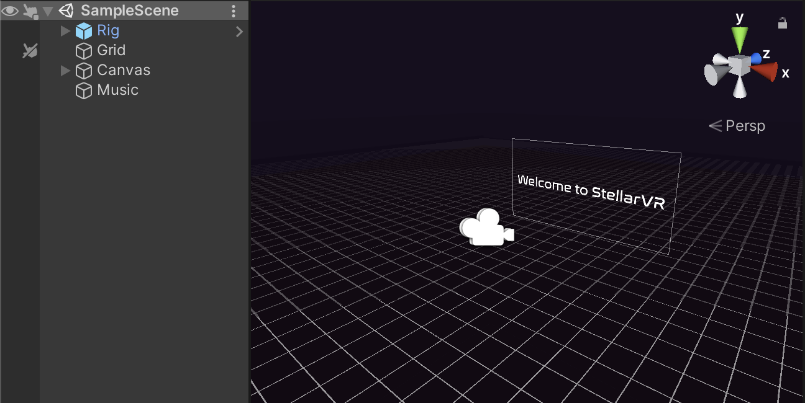

# StellarVR v0.1
Unity assets for developing VR on mobile devices (iOS and Android).

My goal with this is to make development for VR more accessible by providing the framework to be built upon by the developer. As a Mac user and programmer, VR has always been just out of reach for me. Especially with the lack of quality VR games on the mobile market, I want to provide an opportunity for others in my situation to produce more VR content and grow the VR community.

Contact me [@kitsumitsu46](https://twitter.com/kitsumitsu46) on Twitter with any suggestions or feedback.

## How to install?

- Download *StellarVR.unitypackage* from the Github and import into your Unity project
- To import, navigate to **Assets > Import Package > Custom Package...** and select *StellarVR.unitypackage* from the file navigator

I forgot to put the license in the unitypackage, so until I do that make sure to download that as well <3

## What's included?
###### Currently included:
- Script for controlling basic headset movement and binocular vision (3-DOF, includes adjustable FOV and IPD)
  - This also functions in the editor (click and drag to turn camera), although this is still buggy
- Relevant prefabs (pre-setup headset rig)
- A demo scene that demonstrates everything in the current version
###### What is planned:
- Point-and-click system (with laser pointer)
- Fixing the click and drag controls in the editor

